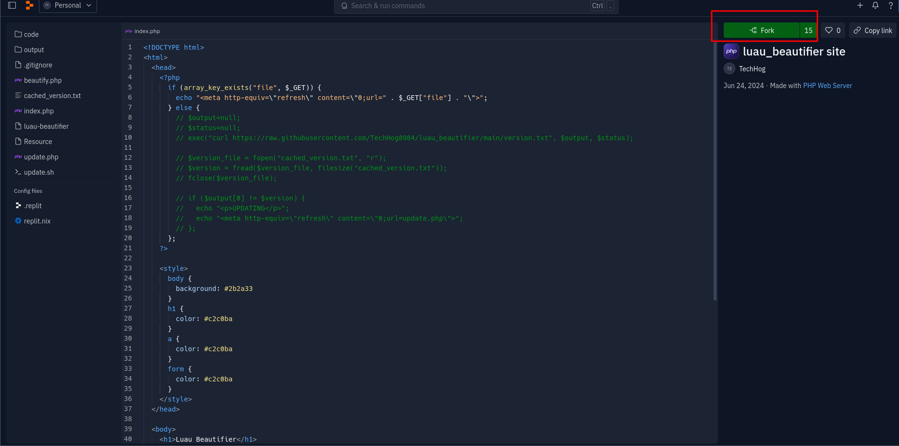
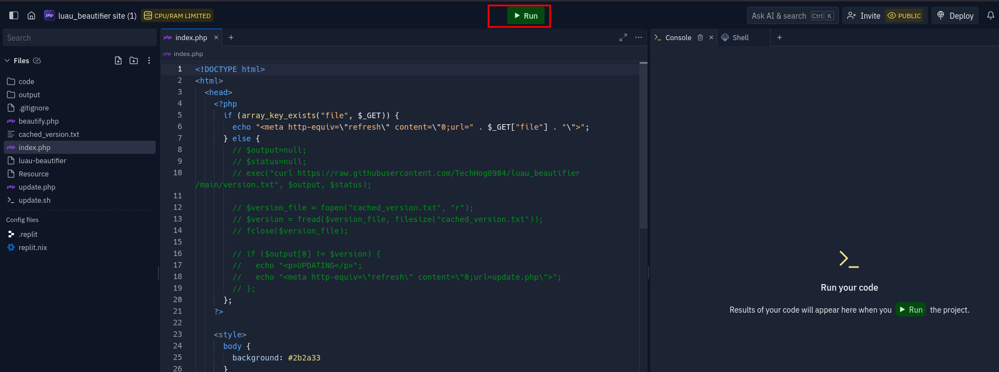
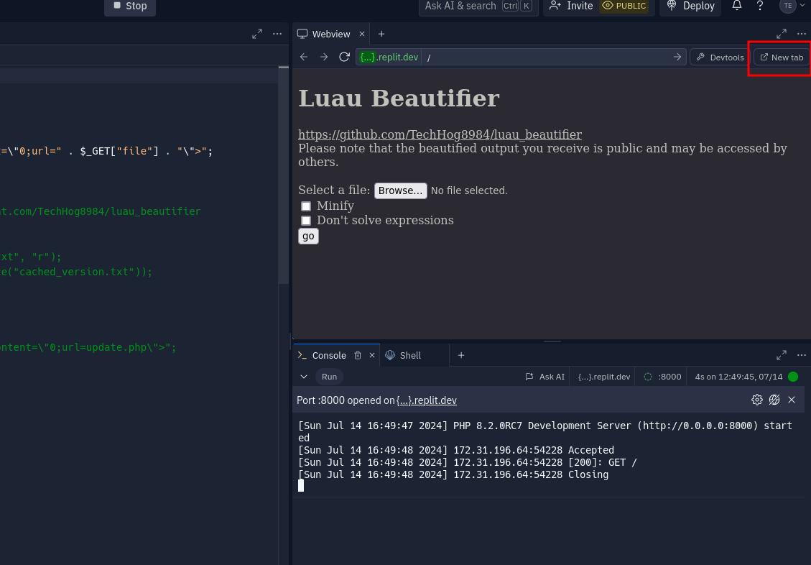

# Luau Beautifier

A beautifier for Luau written in C++

## Replit
You can use luau_beautifier without compiling with [this replit](https://replit.com/@TechHog/luaubeautifier-site).





## Build
> ```sh
> $ make -s
> ```

## Build (web assembly)
> ```sh
> $ make wasm
> ```

## Usage
> Usage: ./luau-beautifier [options] [file]
> <br></br>
> options:<br>
> &nbsp;&nbsp;--minify: switches output mode from beautify to minify<br>
> &nbsp;&nbsp;--nosolve: doesn't solve simple expressions<br>
> &nbsp;&nbsp;--ignoretypes: omits Luau type expressions, keeping the important parts<br>
> &nbsp;&nbsp;--replaceifelseexpr: tries to replace if else expressions with statements<br>
> &nbsp;&nbsp;--extra1: tries to replace certain statements / expression using potentially dangerous methods

If there are errors parsing (both CLI options or the input code), you will see those in stderr.<br>
Otherwise, the beautified code will appear in stdout.

## Other notes
1. The [Luau version used](https://github.com/luau-lang/luau/releases/tag/0.630) is 0.630
2. Currently there is MINIMAL typing support